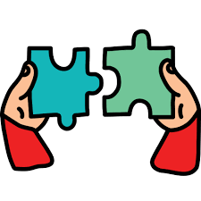

  

<h3 align="center">GROUP WORK DIARY</h3>

---

 hello world
      

## 📝 Contents

- [📝 Contents](#contents)
- [🧐 About ](#about)
- [🏁 Start ](#start)
- [🐱‍👤 Todo ](#todo)
- [✍️ Authors ](#️authors)

## 🧐 About 

Documenting the learning process of our CS group learning

## 🏁 Start 

A good start

## 🐱‍👤 Todo 

- [ ] Upload learning notes
- [ ] Upload developing records
- [ ] Check each other's result and discuss

## ✍️ Authors 

- [@kristenqin](https://github.com/kristenqin) - Initial work
- [@cozychang](https://github.com/cozychang) - project building

See also the list of [contributors](https://github.com/kristenqin/group_practice/contributors) who participated in this project.
