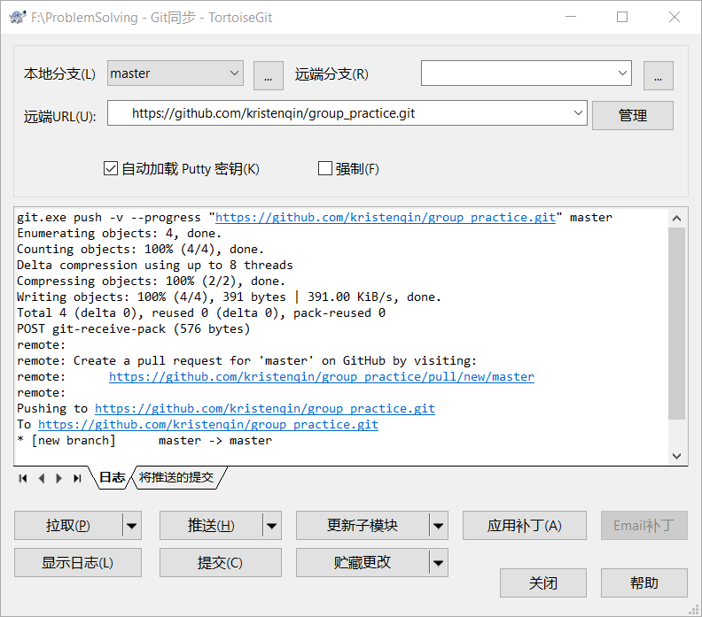
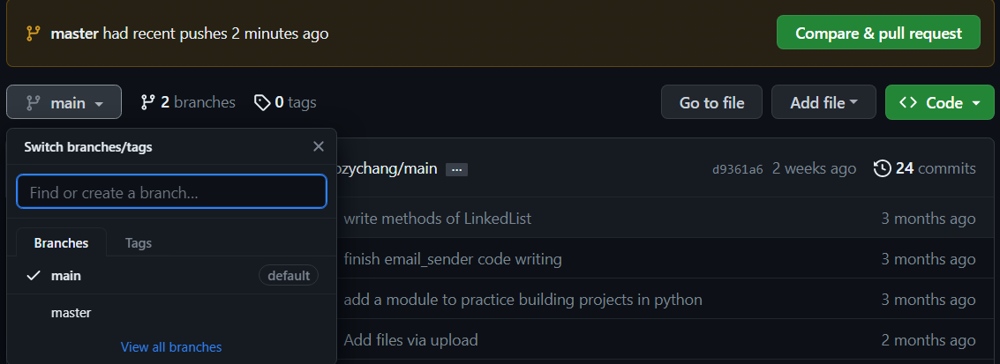

<!--
 * @Date: 2023-05-15 08:25:40
 * @LastEditors: Bigorrila
 * @LastEditTime: 2023-05-15 16:06:52
 * @FilePath: \ProblemSolving\problem2 从本地使用git推送到remote\description.md
-->

从一个本地git仓库推送到remote现有的repo中如何将remote中的内容进行合并呢
不想每次本地建立项目都要找到同一个本地仓库建立

合并分支

分支
- [ ] 是什么
- [ ] 作用是什么
- [ ] 开发场景其他应用场景